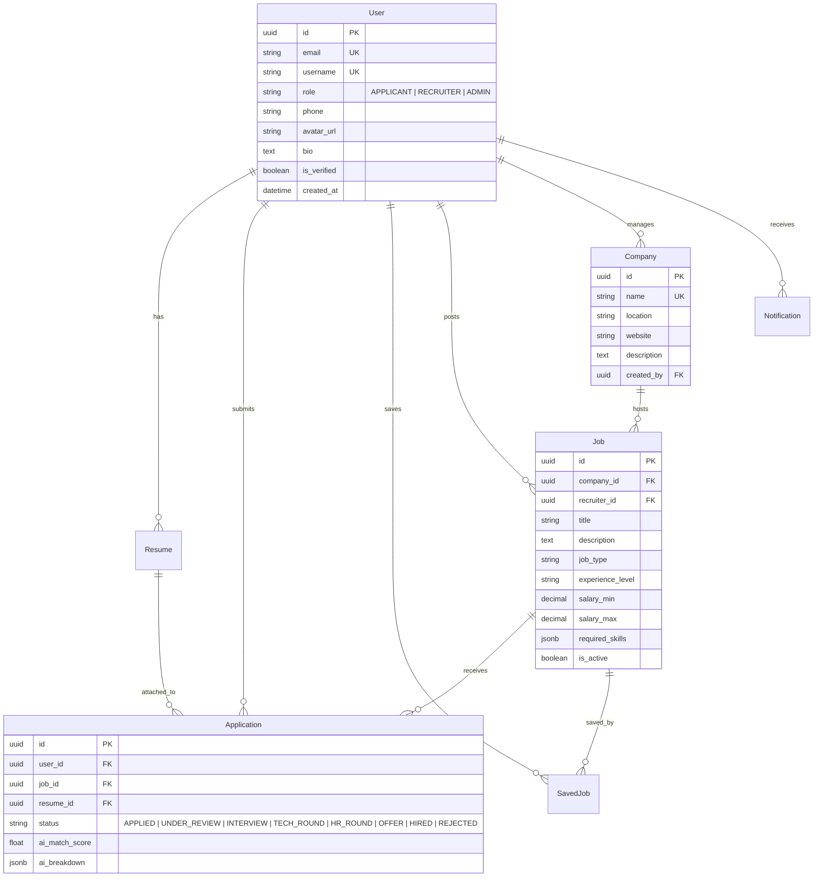

# Database ER Diagram

```mermaid
erDiagram
    User ||--o{ Resume : "has"
    User ||--o{ Application : "submits"
    User ||--o{ SavedJob : "saves"
    User ||--o{ Job : "posts"
    User ||--o{ Company : "manages"
    User ||--o{ Notification : "receives"

    Company ||--o{ Job : "hosts"
    Job ||--o{ Application : "receives"
    Job ||--o{ SavedJob : "saved_by"
    Resume ||--o{ Application : "attached_to"

    User {
        uuid id PK
        string email UK
        string username UK
        string role "APPLICANT | RECRUITER | ADMIN"
        string phone
        string avatar_url
        text bio
        boolean is_verified
        datetime created_at
    }

    Company {
        uuid id PK
        string name UK
        string location
        string website
        text description
        uuid created_by FK
    }

    Job {
        uuid id PK
        uuid company_id FK
        uuid recruiter_id FK
        string title
        text description
        string job_type
        string experience_level
        decimal salary_min
        decimal salary_max
        jsonb required_skills
        boolean is_active
    }

    Application {
        uuid id PK
        uuid user_id FK
        uuid job_id FK
        uuid resume_id FK
        string status "APPLIED | UNDER_REVIEW | INTERVIEW | TECH_ROUND | HR_ROUND | OFFER | HIRED | REJECTED"
        float ai_match_score
        jsonb ai_breakdown
    }
```
