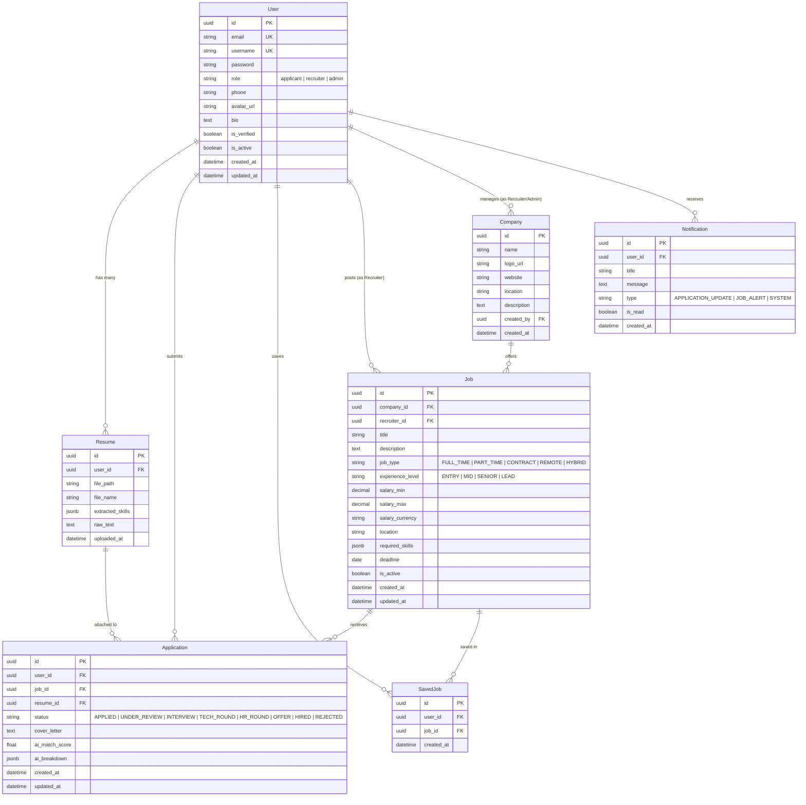

# Implementation Plan: SkillMatch AI — Enterprise-Grade AI Job Portal

SkillMatch AI is an enterprise-ready AI-powered job portal built with React 19 + Vite + Tailwind CSS on the frontend, and Python 3.13 + Django 5 + DRF + PostgreSQL on the backend. This plan details Phase 1 architecture, database schema, ER diagrams, folder structures, and API route definitions, followed by the complete execution roadmap.

---

## User Review Required

> [!IMPORTANT]
> Please review the proposed **Phase 1 Architecture, Folder Structure, Database Schema (ER Diagram), and API Route Specifications** below.
> Confirm if you would like any adjustments to the schema or endpoints before we proceed to Phase 2 (Backend Setup & Data Models).

---

## Phase 1: Architecture, Schema & API Design Proposal

### 1. Project Directory Structure

```text
SkillMatch-AI/
├── .github/
│   └── workflows/
│       ├── ci-cd.yml
│       └── code-quality.yml
├── backend/
│   ├── manage.py
│   ├── requirements.txt
│   ├── Dockerfile
│   ├── .env.example
│   ├── config/
│   │   ├── __init__.py
│   │   ├── asgi.py
│   │   ├── wsgi.py
│   │   ├── urls.py
│   │   └── settings/
│   │       ├── __init__.py
│   │       ├── base.py
│   │       ├── local.py
│   │       └── production.py
│   ├── apps/
│   │   ├── accounts/
│   │   │   ├── __init__.py
│   │   │   ├── admin.py
│   │   │   ├── apps.py
│   │   │   ├── models.py
│   │   │   ├── serializers.py
│   │   │   ├── views.py
│   │   │   ├── urls.py
│   │   │   ├── permissions.py
│   │   │   └── tests/
│   │   ├── companies/
│   │   │   ├── models.py, serializers.py, views.py, urls.py, permissions.py
│   │   ├── jobs/
│   │   │   ├── models.py, serializers.py, views.py, urls.py, permissions.py, filters.py
│   │   ├── applications/
│   │   │   ├── models.py, serializers.py, views.py, urls.py, permissions.py
│   │   ├── resume/
│   │   │   ├── models.py, serializers.py, views.py, urls.py, utils.py
│   │   ├── analytics/
│   │   │   ├── views.py, urls.py, services.py
│   │   ├── notifications/
│   │   │   ├── models.py, serializers.py, views.py, urls.py, services.py
│   │   └── core/
│   │       ├── exceptions.py, pagination.py, logging.py, ai_matcher.py, middleware.py
│   └── logs/
│       ├── application.log
│       ├── security.log
│       └── error.log
├── frontend/
│   ├── package.json
│   ├── vite.config.js
│   ├── tailwind.config.js
│   ├── postcss.config.js
│   ├── index.html
│   ├── public/
│   └── src/
│       ├── main.jsx
│       ├── App.jsx
│       ├── assets/
│       ├── components/
│       │   ├── common/ (Navbar, Footer, Modal, Loader, Protection, Alert)
│       │   ├── ui/ (Button, Input, Card, Badge, CircularProgress, Modal)
│       │   ├── jobs/ (JobCard, JobFilter, JobDetail, MatchScoreBadge)
│       │   ├── resume/ (ResumeUploader, ResumeViewer, AIAnalysisCard)
│       │   └── analytics/ (ChartCard, StatCard, RechartsWidgets)
│       ├── context/ (AuthContext, ThemeContext, NotificationContext)
│       ├── hooks/ (useAuth, useFetch, useTheme, useDebounce)
│       ├── pages/
│       │   ├── public/ (Home, Jobs, JobDetails, Companies, Login, Register, ForgotPassword)
│       │   ├── applicant/ (Dashboard, ApplicationsTrack, SavedJobs, Profile, ResumeManager)
│       │   ├── recruiter/ (Dashboard, JobManage, ApplicantList, JobCreateEdit)
│       │   └── admin/ (Dashboard, UserManage, CompanyManage, LogsView)
│       ├── services/ (api.js, authService.js, jobService.js, applicationService.js, aiService.js)
│       ├── utils/ (formatters.js, constants.js, validators.js)
│       └── styles/ (index.css)
├── docs/
│   ├── architecture.md
│   ├── er_diagram.md
│   ├── api_docs.md
│   ├── deployment.md
│   └── setup.md
├── .gitignore
├── LICENSE
└── README.md
```

---

### 2. Database Schema & ER Diagram



---

### 3. REST API Route Specifications

#### Auth & Accounts (`/api/v1/auth/` & `/api/v1/users/`)
- `POST /api/v1/auth/register/` - Register new user (Applicant / Recruiter)
- `POST /api/v1/auth/login/` - JWT login (returns Access + Refresh tokens)
- `POST /api/v1/auth/refresh/` - Refresh JWT token
- `POST /api/v1/auth/logout/` - Blacklist refresh token
- `POST /api/v1/auth/google/` - Google OAuth authentication
- `POST /api/v1/auth/password-reset/` - Request password reset email
- `POST /api/v1/auth/password-reset-confirm/` - Confirm password reset
- `GET  /api/v1/users/me/` - Get current profile
- `PUT/PATCH /api/v1/users/me/` - Update profile details & avatar
- `GET  /api/v1/users/` - Admin list & search users

#### Companies (`/api/v1/companies/`)
- `GET  /api/v1/companies/` - Public list of companies (search & filter)
- `POST /api/v1/companies/` - Create company (Recruiter/Admin)
- `GET  /api/v1/companies/{id}/` - Company detail
- `PUT/PATCH /api/v1/companies/{id}/` - Edit company (Owner/Admin)
- `DELETE /api/v1/companies/{id}/` - Delete company (Admin)

#### Jobs (`/api/v1/jobs/`)
- `GET  /api/v1/jobs/` - List jobs with search (`q`), skills filter, type, location, experience, pagination
- `POST /api/v1/jobs/` - Post new job (Recruiter/Admin)
- `GET  /api/v1/jobs/{id}/` - Job detail + AI match score (if user logged in & has resume)
- `PUT/PATCH /api/v1/jobs/{id}/` - Edit job (Recruiter owner/Admin)
- `DELETE /api/v1/jobs/{id}/` - Delete job (Recruiter owner/Admin)
- `GET  /api/v1/jobs/recommended/` - Smart job recommendations based on skills & user activity
- `GET  /api/v1/saved-jobs/` - List current applicant's saved jobs
- `POST /api/v1/saved-jobs/` - Save a job
- `DELETE /api/v1/saved-jobs/{job_id}/` - Unsave job

#### Resumes (`/api/v1/resumes/`)
- `GET  /api/v1/resumes/me/` - Get current user's active resume & parsed skills
- `POST /api/v1/resumes/upload/` - Upload PDF resume, trigger AI skill extraction
- `DELETE /api/v1/resumes/me/` - Remove active resume

#### Applications (`/api/v1/applications/`)
- `GET  /api/v1/applications/` - List user's applications (Applicant view) OR job's applicants (Recruiter view)
- `POST /api/v1/applications/` - Submit job application (calculates AI Match Score instantly)
- `GET  /api/v1/applications/{id}/` - Detailed application status & timeline
- `PATCH /api/v1/applications/{id}/status/` - Update status (Recruiter/Admin)

#### Analytics & Global Search (`/api/v1/analytics/` & `/api/v1/search/`)
- `GET  /api/v1/analytics/applicant/` - Applicant stats (applied, status distribution, skill gaps)
- `GET  /api/v1/analytics/recruiter/` - Recruiter stats (applications/mo, top skills, job stats, hiring pipeline)
- `GET  /api/v1/analytics/admin/` - Admin overview stats & activity logs
- `GET  /api/v1/search/global/` - Global unified search across jobs, companies, skills

---

## Phase-by-Phase Roadmap

1. **Phase 1: Architecture, ER Diagram & API Design** (Current Phase - Plan Proposal)
2. **Phase 2: Backend Setup & Database Schema** (Django 5 init, models, PostgreSQL connection, migrations)
3. **Phase 3: Security, Auth & Logging** (Simple JWT, Refresh Rotation, Role Permissions, Custom Middleware, Structured Logging)
4. **Phase 4: Core Services & AI Match Engine** (TF-IDF / Jaccard skill extraction, scoring algorithm, recommendation pipeline)
5. **Phase 5: Backend API Implementation & Docs** (ViewSets, Serializers, Filters, Swagger / OpenAPI specs)
6. **Phase 6: Frontend Foundation & Design System** (Vite + React 19, Tailwind CSS, Dark Mode, Custom UI Components)
7. **Phase 7: Frontend Authentication & Navigation** (AuthContext, JWT Storage, Protected Routes, Navbar/Footer)
8. **Phase 8: Job Portal & Application Workflows** (Job Search, Job Details, PDF Resume Viewer, Application Timeline)
9. **Phase 9: Role Dashboards & Recharts Analytics** (Applicant, Recruiter & Admin dynamic interactive analytics)
10. **Phase 10: AI Match Visualizations & Global Search** (Circular progress match meters, skill gap chips, multi-model global search)
11. **Phase 11: Backend & Frontend Testing** (Pytest / Django TestCase for API & Auth, React testing)
12. **Phase 12: CI/CD & Deployment Configurations** (GitHub Actions, Vercel frontend config, Render backend config, Neon DB connection, README & Docs generation)

---

## Verification Plan

### Automated Tests
- Django test runner (`python manage.py test`) for Auth, Permissions, Job CRUD, Applications, AI Matcher.
- Front-end linting & build verification (`npm run build`).

### Manual Verification
- Test registration/login flow for Applicant, Recruiter, and Admin.
- Upload sample resume PDF and test AI match calculation against posted job skills.
- Verify status timeline progression and Recharts analytics render cleanly in dark and light modes.
